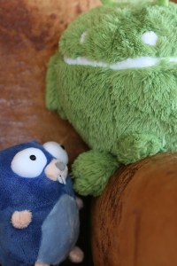

# 简单二次封装的golang图像处理库:图片裁剪

## 功能

> 1.Go语言下的官方图像处理库，貌似已经找不到了，所以收藏起来
><p>2.简单封装后对jpg和png图像进行缩放|裁剪的库

## 使用说明

1.首先下载
```
go get -v -u github.com/hunterhug/go_image
```

2.主要函数

按照宽度进行等比例缩放,第一参数是图像文件,第二个参数是缩放后的保存文件路径

```
err := ScaleF2F(filename, savepath, width)
```

按照宽度和高度进行等比例缩放,第一参数是图像文件,第二个参数是缩放后的保存文件路径

```
err = ThumbnailF2F(filename, save1path, width, height)
```

检测图像文件真正文件类型,并返回真实文件名,参数为图像文件位置

```
realfilename, err := RealImageName(savepath)
```

改变图像文件名,第一个参数为文件原始名字,第二个参数是文件改名后名字,第三个参数表示是否强制改名

```
err=ChangeImageName(savepath,realfilename,false)
```

## 使用示例

### example_test.go

```
package go_image

import (
	"fmt"
	"testing"
)

//将某一图片文件进行缩放后存入另外的文件中
func TestImage(t *testing.T) {
	//打印当前文件夹位置
	fmt.Printf("本文件文件夹位置:%s\n", CurDir())

	//图像位置
	filename := "./testdata/gopher.png"

	//保存位置
	savepath := "./testdata/gopher200.jpg"
	save1path := "./testdata/gopher200_400.png"

	//宽度,高度
	width := 200
	height := 400

	//按照宽度进行等比例缩放
	err := ScaleF2F(filename, savepath, width)
	if err != nil {
		fmt.Printf("%s\n", err.Error())
	} else {
		fmt.Printf("生成按宽度缩放图%s\n", savepath)
	}

	//按照宽度和高度进行等比例缩放
	err = ThumbnailF2F(filename, save1path, width, height)
	if err != nil {
		fmt.Printf("%s\n", err.Error())
	} else {
		fmt.Printf("生成按宽度高度缩放图%s\n", save1path)
	}

	//查看图像文件的真正名字
	//如 ./testdata/gopher400.jpg其实是png类型,但是命名错误,需要纠正!
	realfilename, err := RealImageName(savepath)
	if err != nil {
		fmt.Printf("%s\n", err.Error())
	} else {
		fmt.Printf("真正的文件名:%s\n", realfilename)
	}

	//文件改名,不强制性
	err = ChangeImageName(savepath, realfilename, false)
	if err != nil {
		fmt.Printf("文件改名失败:%s%s\n", realfilename, err.Error())
	}

	//文件改名,强制性
	err = ChangeImageName(savepath, realfilename, true)
	if err != nil {
		fmt.Printf("文件改名失败:%s%s\n", realfilename, err.Error())
	} else {
		fmt.Println("改名成功")
	}
}
```

### 结果

```
/home/hunterhug/golang/go1.6/bin/go test -v github.com/hunterhug/go_image -run ^TestImage$
本文件文件夹位置:/home/hunterhug/golang/pikapika/src/github.com/hunterhug/go_image
生成按宽度缩放图./testdata/gopher200.jpg
生成按宽度高度缩放图./testdata/gopher200*400.png
真正的文件名:./testdata/gopher200.png
文件改名失败:./testdata/gopher200.pngFile already exist error
改名成功
```

原始图片:


宽度200px等比例缩放裁剪:




宽度200px,高度400px等比例缩放裁剪:


## 来自

This is a Graphics library for the Go programming language.

Unless otherwise noted, the graphics-go source files are distributed
under the BSD-style license found in the LICENSE file.

Contributions should follow the same procedure as for the Go project:
http://golang.org/doc/contribute.html

